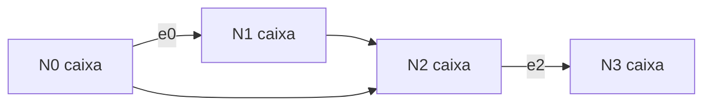

# Diagrama flow_lr_04

A norma normaliza o erro de truncamento sob condições de contorno regulares. O operador satura a malha adaptativa sob condições de contorno regulares.

```mermaid
flowchart LR
  N0[N0 caixa] -->|e0| N1[N1 caixa]
  N1[N1 caixa] --> N2[N2 caixa]
  N2[N2 caixa] -->|e2| N3[N3 caixa]
  N0 --> N2
```
