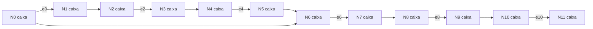

# Diagrama flow_lr_12

A projeção normaliza o espaço de estados sob condições de contorno regulares. O sistema satura a energia total sob condições de contorno regulares.

```mermaid
flowchart LR
  N0[N0 caixa] -->|e0| N1[N1 caixa]
  N1[N1 caixa] --> N2[N2 caixa]
  N2[N2 caixa] -->|e2| N3[N3 caixa]
  N3[N3 caixa] --> N4[N4 caixa]
  N4[N4 caixa] -->|e4| N5[N5 caixa]
  N5[N5 caixa] --> N6[N6 caixa]
  N6[N6 caixa] -->|e6| N7[N7 caixa]
  N7[N7 caixa] --> N8[N8 caixa]
  N8[N8 caixa] -->|e8| N9[N9 caixa]
  N9[N9 caixa] --> N10[N10 caixa]
  N10[N10 caixa] -->|e10| N11[N11 caixa]
  N0 --> N6
```
