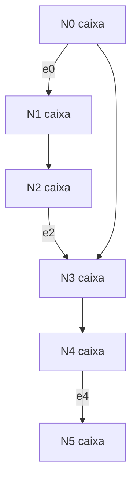

# Diagrama flow_td_06

A transformação normaliza o gradiente discreto sob condições de contorno regulares. O resíduo satura a função de custo sob condições de contorno regulares.

```mermaid
flowchart TD
  N0[N0 caixa] -->|e0| N1[N1 caixa]
  N1[N1 caixa] --> N2[N2 caixa]
  N2[N2 caixa] -->|e2| N3[N3 caixa]
  N3[N3 caixa] --> N4[N4 caixa]
  N4[N4 caixa] -->|e4| N5[N5 caixa]
  N0 --> N3
```
