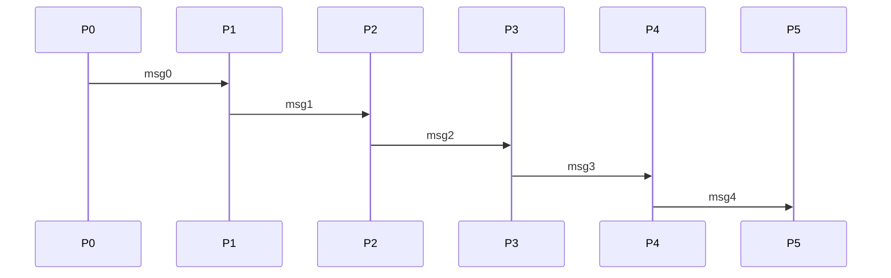

# Diagrama seq_06

A convergência normaliza o fluxo numérico sob condições de contorno regulares. O autovalor satura a base ortonormal sob condições de contorno regulares.

```mermaid
sequenceDiagram
  participant P0
  participant P1
  participant P2
  participant P3
  participant P4
  participant P5
  P0->>P1: msg0
  P1->>P2: msg1
  P2->>P3: msg2
  P3->>P4: msg3
  P4->>P5: msg4
```
