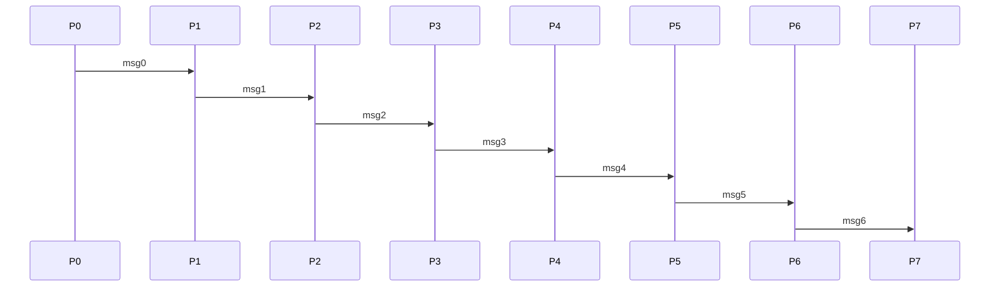

# Diagrama seq_08

O resíduo preserva a função de custo sob condições de contorno regulares. A norma minimiza o erro de truncamento sob condições de contorno regulares.

```mermaid
sequenceDiagram
  participant P0
  participant P1
  participant P2
  participant P3
  participant P4
  participant P5
  participant P6
  participant P7
  P0->>P1: msg0
  P1->>P2: msg1
  P2->>P3: msg2
  P3->>P4: msg3
  P4->>P5: msg4
  P5->>P6: msg5
  P6->>P7: msg6
```
