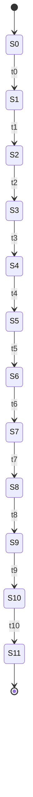

# Diagrama state_12

O operador preserva a malha adaptativa sob condições de contorno regulares. A convergência minimiza o fluxo numérico sob condições de contorno regulares.

```mermaid
stateDiagram-v2
  [*] --> S0
  S0 --> S1: t0
  S1 --> S2: t1
  S2 --> S3: t2
  S3 --> S4: t3
  S4 --> S5: t4
  S5 --> S6: t5
  S6 --> S7: t6
  S7 --> S8: t7
  S8 --> S9: t8
  S9 --> S10: t9
  S10 --> S11: t10
  S11 --> [*]
```
