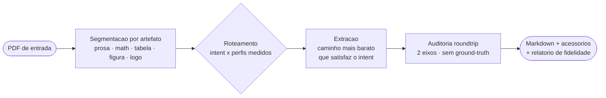
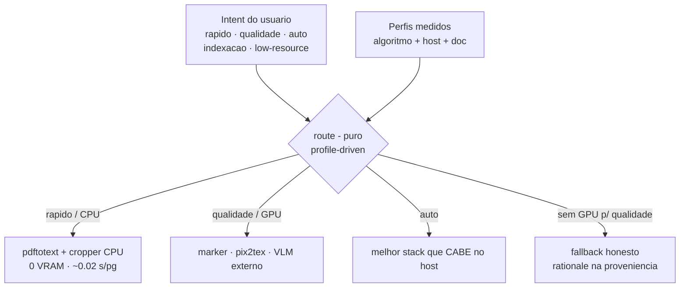
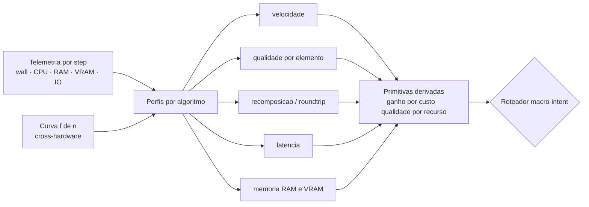
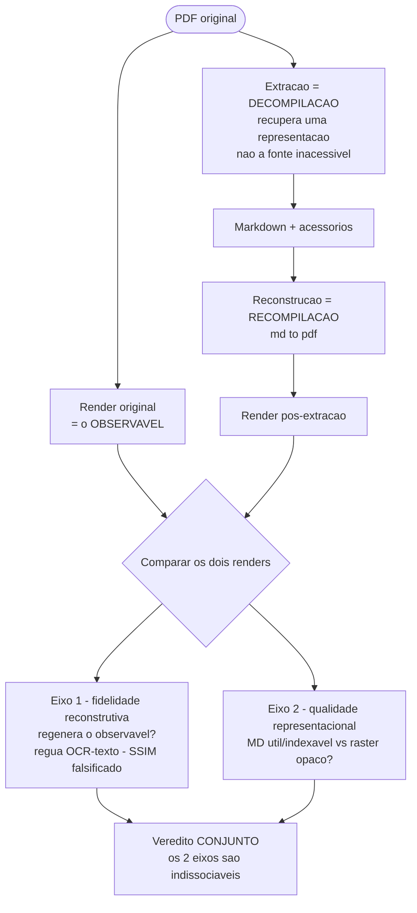

# Arquitetura & Painel — pdf2md

> **Snapshot 2026-06-28 (reescrito).** Este é o painel conceitual do projeto: o
> que ele é, como o fluxo funciona, a teoria, o que já existe e o que está em
> curso. É um documento **L2** (paisagem datada — Strata): números e estado se
> movem; reconferir antes de citar como fato.
>
> A versão anterior enquadrava o projeto como "4 camadas + round-trip como
> *health-check*". **Isso mudou:** o round-trip deixou de ser um termômetro
> auxiliar e virou a **razão de existir** (o auditor de fidelidade). Os detalhes
> por camada (ainda válidos) ficam em [`arquitetura/`](arquitetura/);
> a tese da família em [`transmutos.md`](transmutos.md).

---

## 1. Posicionamento — o que o pdf2md é (e o que não é)

**Não é mais um extrator.** Esse sub-papel está perdido: os VLMs de OCR de 2024–2026
(MinerU2.5, olmOCR-2, Surya-2, PaddleOCR-VL, DeepSeek-OCR) extraem MD/LaTeX/tabela
melhor que a cadeia que o pdf2md orquestra, e vários rodam até em CPU — ver o
confronto honesto em [`reference/panorama_extractores_ocr.md`](../reference/panorama_extractores_ocr.md).

**O pdf2md é um ROTEADOR + AUDITOR.** O que sobrevive ao panorama — e é raro — são
duas coisas que **nenhum** daqueles extratores entrega:

- decidir, por **intent + custo medido**, qual caminho usar (e degradar com
  honestidade quando o host não comporta); e
- **PROVAR fidelidade da extração por documento, SEM ground-truth.** Todo VLM de OCR
  pode **alucinar texto plausível em silêncio** e só reporta score de *benchmark*
  agregado; o auditor mede a página que você acabou de processar. Por isso ele fica
  **mais** necessário, não menos, conforme o extrator vira um VLM falível — e é o que
  permite **desafiar modelos que afirmam "extrair mais conteúdo"**.

As três linhas que estruturam o projeto (e este painel):

| Linha | O que é | Desenho |
|---|---|---|
| **Multirouteamento** | caminho mais barato que satisfaz o intent | [§3](#3-multirouteamento) |
| **Calibragem de primitivas de utilidade** | telemetria → perfis → primitivas (velocidade/qualidade/recomposição/latência/memória) | [§4](#4-calibragem-de-primitivas-de-utilidade) |
| **Auditor com roundtrip** | fundado em construção de compiladores (decompilar/recompilar) + modernização nossa | [§5](#5-auditor-com-roundtrip-fundamentos-de-compiladores) |

---

## 2. Visão geral do fluxo

Caixas com o **conceito geral** — cada uma se abre num desenho específico abaixo.



**Abrir cada caixa:** [Roteamento →](#3-multirouteamento) ·
[Como o roteador conhece o custo →](#4-calibragem-de-primitivas-de-utilidade) ·
[Auditoria/roundtrip →](#5-auditor-com-roundtrip-fundamentos-de-compiladores)

> *Segmentação por artefato* é o princípio transmutos: o documento não é um blob,
> é uma **composição de mini-pipelines** (prosa, math, tabela, figura), cada um com
> seu `extrair → reconstruir → medir`. Ver [`transmutos.md`](transmutos.md) e
> [`philosophy.md`](philosophy.md).

---

## 3. Multirouteamento

O roteador `route()` é **puro e profile-driven**: dado o *intent* do usuário e os
perfis medidos do host+documento, escolhe o pipeline mais barato que ainda entrega
o que o intent pede — e, quando o host não comporta, **degrada com aviso** (a
justificativa vai para a proveniência), nunca finge qualidade nem quebra em silêncio.



Código: [`src/pdf2md/routing.py`](../../src/pdf2md/routing.py) (`route()` +
`HostInfo`/`DocInfo` + `pass2_warranted`), perfis em
[`src/pdf2md/_profiles.py`](../../src/pdf2md/_profiles.py), execução em
[`executor.py`](../../src/pdf2md/executor.py). Intents detalhados em
[`how-to/escolher_intent.md`](../how-to/escolher_intent.md).

---

## 4. Calibragem de primitivas de utilidade

Como o roteador **sabe** o custo? Não por palpite — por medição. A telemetria por
step alimenta perfis por algoritmo, que se projetam em **primitivas de utilidade**
comparáveis; primitivas derivadas (ganho/custo) e a curva `f(n)` cross-hardware
fecham a decisão.



As primitivas são as **âncoras medidas** que o README publica (RTX 3060, N pequeno):
velocidade ~0.02 s/pg (pdftotext) vs ~12.9 (marker); RAM 63 MB vs ~1500; latência
0.1 s vs ~30 s; qualidade roteada por sub-elemento (prosa 0.95 · matriz 0.50 ⚠).
Instrumento: [`telemetry.py`](../../src/pdf2md/telemetry.py); perfis publicados em
[`docs/profiles/`](../profiles/). **Escopo honesto:** 1 host, N pequeno; RAM/cold-start
de marker/VLM são *estimados* — é "roteamento medido para este corpus", não benchmark
universal.

---

## 5. Auditor com roundtrip (fundamentos de compiladores)

O auditor é o **fosso** do projeto. A ideia vem da **construção de compiladores**, com
uma modernização nossa.

**O princípio (decompilador/recompilador).** Um decompilador não recupera o
*código-fonte* original que gerou o binário — esse fonte é inacessível (caixa-preta).
Ele recupera **uma representação que, recompilada, produz o mesmo observável**. A
prova é *cycle-consistency* sobre o invariante observável, não sobre a fonte.

Aplicado ao PDF: a extração é uma **decompilação** (PDF → MD; não recuperamos o
processo que criou o PDF, só uma representação); a reconstrução `md → pdf` é a
**recompilação**; o **observável** é a página renderizada. Se a representação extraída
regenera o observável, ela *representa* a informação da página — mesmo sem sabermos a
fonte. (Ver [`transmutos.md`](transmutos.md): "objeto descompilado universal".)



**A modernização nossa (sobre o princípio clássico):**

1. **Métrica de comparação plugável.** A comparação imagem×imagem é abstrata; a régua
   é trocável. O SSIM (pixel) foi **falsificado** como régua de conteúdo (correlação
   ~0 com fidelidade real; chega a ranquear um raster como "mais fiel"); a régua
   adotada é **OCR-de-texto** sobre os dois renders.
2. **Dois eixos ortogonais e indissociáveis.** A fidelidade sozinha é enganada pelo
   **raster** (o OCR lê o texto da imagem embutida e a acha "fiel"); a qualidade
   sozinha é enganada pela **alucinação** (MD bem-formado, porém inventado). Só os dois
   **juntos** separam extração boa de degeneração — nunca colapsar num escore único.

**Por que isto desafia "extrair mais conteúdo".** Um VLM que afirma extrair mais não
prova que extraiu **certo**; pode alucinar plausível. O auditor mede fidelidade
por-documento sem GT e pega exatamente esse modo de falha — vira um **verificador que
roda EM CIMA de qualquer extrator** (inclusive dos VLMs do panorama), não um
concorrente deles.

**Estado (honesto):** é a tese do [T195](../../tickets/open/T195_roundtrip_prova_fidelidade.md)
(aberto). Já **medido** (ondas 0/1): a régua OCR rastreia conteúdo (SSIM não), os 2
eixos separam os degenerados, e o instrumento **pegou uma falha real sem GT** (um PDF
escaneado em que o pdftotext extraiu quase nada → fidelidade 0.076). **Falta** provar
que pega uma **alucinação de VLM** (mais difícil que a falha-vazia) — próxima onda.
Código atual do eixo visual: [`pixel_roundtrip.py`](../../src/pdf2md/pixel_roundtrip.py)
(extra `[rtpixel]`).

---

## 6. O que já se tem (entregue)

| Capacidade | Estado |
|---|---|
| **Roteador macro-intent** (6 intents) + degradação honesta | Estável (T090) |
| **Extração CPU** pdftotext/PyMuPDF + Tesseract (scan) | Estável — offline, determinístico |
| **Cropper de fórmula CPU built-in** + pix2tex (math→LaTeX) | Estável |
| **Extração GPU** marker-pdf (externo, venv próprio) | Estável |
| **MD → PDF** pandoc + Chrome + KaTeX (+ **mermaid** offline, T190) | Estável |
| **Telemetria por step** (wall/cpu/mem/gpu/io, overhead <1%) | Estável |
| **Roundtrip textual + multi-iteração** | Estável |
| **Pixel-roundtrip visual** (align + SSIM) — base do auditor | Estável (`[rtpixel]`) |
| **TEDS de tabelas** (`table_teds`) | Estável (T075, `[tables]`) |
| **Otimização adaptativa de imagens** (−38.6% N&C) | Estável |
| **Corpus em 3 tiers** + sintético GT-por-construção (75 itens) | Estável (T065) |

Instalação e uso ficam no [README](../../README.md) e em [§8](#8-instalação-e-uso).

---

## 7. O que está sendo trabalhado

| Frente | Onde |
|---|---|
| **Auditor de fidelidade** (roundtrip-como-prova, 2 eixos) | [T195](../../tickets/open/T195_roundtrip_prova_fidelidade.md) — ondas 0/1 feitas; onda 2 = pegar alucinação de VLM |
| **Confronto com extratores externos** na régua sem-GT | [T194-F3](../../tickets/research/T194_programa_comparativo_cientifico.md) + [panorama](../reference/panorama_extractores_ocr.md) (shortlist CPU-viável) |
| **Recalibração do braço de densidade** do `pass2_warranted` | [T193](../../tickets/open/T193_pass2_densidade_sparse_saudavel.md) |
| **Release 0.8.2** (mermaid + cropper + TEDS + README_PYPI no master, não no PyPI) | — |
| Reconstrução vetorial de logos · cross-hardware `f(n)` | T180 · T091 (pesquisa) |

---

## 8. Instalação e uso

```bash
pip install pdf2md-tool            # núcleo CPU — nada externo, sem GPU/rede/modelos
pdf2md doctor                      # o que o host tem (core sempre OK; resto opcional)
pdf2md convert paper.pdf --intent rapido --out out/
```

- Extras pip puros: `[rtpixel]` (validador visual), `[ocr]` (wrapper tesseract),
  `[tables]` (TEDS), `[all]`.
- Capacidades **externas** (marker/GPU, pix2tex, tesseract, pandoc/Chrome, ollama)
  não entram por pip — são detectadas por `pdf2md doctor`. Detalhes e tabela no
  [README §Instalação](../../README.md) e [§Uso](../../README.md).
- Desenvolver/rodar o master: [how-to/instalar_do_fonte.md](../how-to/instalar_do_fonte.md).
- Escolher o intent certo: [how-to/escolher_intent.md](../how-to/escolher_intent.md);
  referência de CLI: [reference/cli.md](../reference/cli.md).

---

## 9. Teoria e leitura adicional

- **Tese da família** (decompilar/recompilar; MD como pivot canônico): [`transmutos.md`](transmutos.md)
- **Filosofia** (hierarquia de prioridades, eixo de representação, fechamento recursivo): [`philosophy.md`](philosophy.md)
- **Avaliação** (formato artigo, medido × literatura): [`avaliacao.md`](avaliacao.md)
- **Panorama de extratores OCR 2023–2026** (confronto): [`../reference/panorama_extractores_ocr.md`](../reference/panorama_extractores_ocr.md)
- **Detalhe por camada** (extração/otimização/reconstrução/métrica/pipeline): [`arquitetura/`](arquitetura/)
- **Perfis medidos**: [`../profiles/`](../profiles/) · **Tecnologias**: [`../reference/tecnologias.md`](../reference/tecnologias.md)
